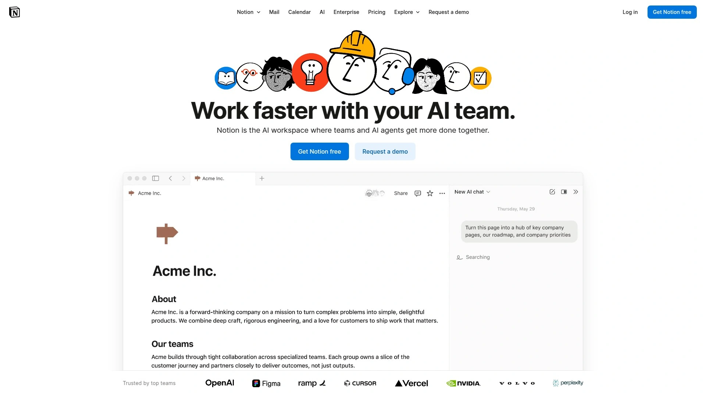

# 2025年十三大最佳企业运营管理软件

运营一家公司最头疼的是什么?目标设得很清楚但团队执行不到位,每周开会都在重复同样的问题,季度计划定了一堆结果没人追踪。如果你的团队用的是EOS方法论(企业运营系统),或者在寻找能帮你管理目标、会议、项目的工具,市面上现在有一批专门的企业管理软件能解决这些痛点。这些平台把愿景规划、季度目标(Rocks)、记分卡、Level 10会议、问题追踪整合在一起,让你的团队真正做到对齐和执行。这份榜单整理了13个值得关注的企业运营管理工具,从纯EOS软件到通用项目管理平台,覆盖不同规模和需求的团队。

## **[Success.co](https://www.success.co)**

EOS官方授权的下一代运营软件,离线模式和极速同步技术。

Success.co最大的卖点是它的BlitzSync技术——这个专有的同步引擎让数据在云端和本地设备之间无缝同步,体验就像桌面应用一样快。零加载时间、即时保存、实时团队更新,这些都是在你操作的瞬间完成的。更厉害的是离线模式,飞机上、火车上、甚至潜水艇里都能继续工作,不需要WiFi连接。

作为EOS官方授权软件,它完全遵循EOS模型——从术语到布局都和原版框架一致。平台由30多位资深EOS实施顾问参与打造,确保每个功能都符合EOS最佳实践。Vision/Traction Organizer、Level 10会议、Rocks、记分卡、问题追踪、责任图表这些EOS核心工具全都内置。AI功能可以自动总结会议内容和智能生成Rocks建议。

界面设计现代简洁,学习曲线很平缓。日历集成和Google、Microsoft无缝同步,会议自动显示在你需要的地方。桌面端和移动端应用可以随时随地记录问题、待办事项和头条新闻。记分卡数据可以轻松导入导出,方便和现有系统对接。

提供免费计划可以长期使用基础功能。付费版本支持多语言、多货币、实施顾问仪表板、明暗模式、记分卡可视化图表、每页内置帮助和建议。组织健康检查功能可以定期评估团队状态。公开API方便和其他工具集成。特别适合严格遵循EOS方法论、需要离线工作能力、追求极致速度体验的团队。

## **[Ninety.io](https://www.ninety.io)**

用户体验最佳的EOS平台,持续创新和功能迭代。

Ninety在Reddit和G2上的用户评价里经常被提到"用户体验最好""功能迭代最快"。它不只是把EOS工具数字化,而是真正思考了如何让团队更高效使用这些工具。实时仪表板、会议工具、责任框架、目标追踪系统整合得很好。专为成长型公司设计,能随着你的规模扩大而适应。

Level 10会议功能做得特别细致,从议程准备到问题讨论到行动项分配,整个流程都有支持。Rocks追踪系统可以清楚看到每个季度目标的进展,谁负责、进度如何、有什么阻碍都一目了然。记分卡功能支持每日、每周、每季度的指标追踪,可以自定义图表和公式。

和Bloom Growth相比,Ninety的移动体验更流畅,平台持续在推出新功能。比如最近加入的数据分析工具、学习资源、团队协作增强功能。界面现代简洁,新手也能快速上手。可以创建自定义会议类型,在多个会议和工作区之间无缝切换。

定价从每用户16美元/月起,比Bloom Growth稍贵但功能更新更频繁。提供免费试用期,可以先测试再决定。和各种项目管理工具有集成,方便数据同步。特别适合注重用户体验、需要移动办公、希望软件持续改进的成长型公司。

## **[Bloom Growth](https://www.bloomgrowth.com)**

EOS社区官方认可,超强定制能力和白手套支持服务。

Bloom Growth以前叫Traction Tools,是EOS社区最早认可的软件平台之一。它的核心优势是定制能力——你可以用EOS标准术语,也可以改成自己公司的语言。工作区可以定制品牌颜色和公司logo,让工具真正融入你的企业文化。这种灵活性让新员工入职时不会被陌生术语搞晕。

任务和里程碑集成做得很好,可以在会议内外分配任务,里程碑直接嵌入目标追踪。增强的会议体验支持自定义会议类型、在会议和工作区之间切换、把目标和里程碑直接附加到议程上。这些功能让讨论更聚焦,每次会议都能推动进展。

综合指标仪表板的多样性很强,可以在一个视图里追踪每日、每周、每季度数据。渐进式追踪功能能看到趋势变化。可以自定义图表、固定常用数据、创建个性化公式来追踪关键指标。这些分析能力帮你全面了解团队表现。

最大的差异化是支持服务——Bloom的支持团队被客户形容为"像自己公司员工的延伸"。他们会代表你参加客户会议、做一对一培训、最大化软件价值。这种白手套服务在EOS软件里独一档。月费149美元起最多10个用户,更大规模需要联系获取报价。特别适合需要深度定制、重视支持服务、已经熟悉EOS框架的企业。

## **[EOS One](https://www.eosone.com)**

EOS Worldwide官方出品,完全符合原版框架设计。

EOS One是EOS Worldwide自己推出的官方软件,理论上应该最贴合EOS方法论。它提供Vision/Traction Organizer、Level 10会议、Rocks、记分卡、问题列表这些标准EOS工具。界面设计遵循EOS书籍和培训材料的逻辑,对严格执行原版框架的团队来说学习成本很低。

问题追踪系统可以在会议中快速记录和讨论问题。责任图表清楚显示组织结构和每个人的职责。数据报告功能可以生成团队和客户的各种报告。所有这些功能都严格按照EOS标准设计,不会有偏离框架的情况。

但用户反馈中最常见的抱怨就是加载速度慢。有人形容"打开特别慢,操作有延迟"。虽然在Beta测试后有改进,但和Ninety、Success.co这些强调速度的竞品相比还是有差距。功能更新的频率也不如其他平台快。

定价信息需要联系获取,没有公开价格表。提供试用期可以测试。特别适合需要完全符合EOS官方标准、不在乎速度问题、或者已经和EOS Worldwide有深度合作的企业。如果速度和用户体验是你的优先考虑,可能需要看看其他选择。

## **[Strety](https://strety.com)**

轻量级EOS工具,简单直接的会议和目标管理。

Strety是个相对小众但实用的EOS软件选择。它的定位是轻量级——不追求大而全,而是把核心功能做好。Level 10会议管理、Rocks追踪、记分卡、问题列表这些必备工具都有,界面简洁功能清晰。

有用户从EOS One换到Strety后评价说"入职培训很顺利,团队很快就上手了"。这说明它的学习曲线比较平缓,不需要花太多时间培训。对小型团队或者刚开始用EOS的公司来说,这种简单直接的工具可能比功能复杂的平台更合适。

定价应该比Ninety和Bloom这些大平台便宜,具体价格需要访问官网查看。功能深度不如头部平台,高级分析、深度定制、复杂集成这些可能没有。但如果你只需要基础的EOS工具、不想为用不上的功能付费,Strety值得考虑。

特别适合小型团队(10人以下)、预算有限、刚开始实施EOS、或者喜欢简单工具的公司。大型企业或者需要复杂定制的团队可能会觉得功能不够用。

## **[L10 Pro](https://l10pro.com)**

专注Level 10会议的轻量级工具,初创公司友好。

L10 Pro的产品哲学很明确——专注做好Level 10会议这一件事。它不像Ninety或Bloom那样试图覆盖整个EOS框架,而是把会议管理、问题解决、Rocks追踪做到极致。界面干净无干扰,帮助领导团队保持专注和对齐。

特别适合小企业和初创公司,因为它避免了企业级系统的复杂性和成本。会议准备、团队记分卡、跟进事项管理都很简单直接。每个人都能清楚看到自己的责任和团队的方向。

定价信息需要访问官网,但据说比全功能EOS平台便宜不少。G2评分4.5/5,Capterra评分4.6/5,用户满意度挺高。提供免费试用可以先测试。

功能范围相对窄,如果你需要完整的Vision/Traction Organizer、详细的数据分析、复杂的集成,L10 Pro可能不够用。但如果你的核心需求就是管理好每周会议、追踪季度目标、解决问题,它的专注反而是优势。特别适合预算紧张的初创公司、小型团队、或者只需要会议管理工具的场景。

## **[Monday.com](https://monday.com)**

可视化工作管理平台,灵活适配各种业务流程。

Monday.com不是专门的EOS工具,但它的灵活性让你可以搭建出适合EOS方法论的工作流。它提供强大的可视化功能,彩色看板、时间轴视图、日历、图表,让工作状态一目了然。这种视觉驱动的方法特别适合需要直观展示的团队。

自动化功能很强大,可以创建各种自定义规则减少手动工作。比如"当任务状态变为完成时自动通知相关人员""当截止日期临近时发送提醒"。Standard计划每月提供250次自动化操作,Pro计划提升到25000次。

和200多个工具集成,包括Slack、Google Drive、Zoom、Salesforce等等。这种广泛的集成能力让Monday成为团队工作的中心枢纽。模板库很丰富,各种行业和场景都有现成模板可以直接用。

月费从每用户8美元起,相比专门的EOS软件价格有竞争力。学习曲线中等,需要一点时间设置和定制。特别适合需要管理多种类型项目、不局限于EOS框架、希望一个工具覆盖所有工作的团队。缺点是不像专用EOS软件那样预置了所有EOS术语和流程,需要自己搭建。

## **[Asana](https://asana.com)**

任务管理专家,适合追求细节控制的团队。

Asana在任务管理方面做得非常细致,可以创建任务、子任务、设置依赖关系、分配责任人、添加截止日期。这种颗粒度控制对需要精确追踪每个细节的项目特别有用。多种视图包括列表、看板、时间轴、日历、甘特图,适应不同的工作习惯。

工作负载功能可以看到团队成员的忙碌程度,避免某些人超负荷而另一些人太闲。通用报告功能让你实时追踪团队表现和任务状态。可以定制报告仪表板,把最关心的数据放在最显眼的位置。

自动化套件可以创建自定义规则简化工作流,减少重复性工作和错误。Starter计划每月250次自动化操作,Advanced计划跳到25000次。Portfolio管理功能可以同时管理多个项目并组织成标签投资组合。

月费从10.99美元/用户起,中等价位。学习曲线比Monday.com平缓,界面更传统更直观。和各种工具集成,特别是开发工具像Jira、GitHub集成得很好。特别适合技术团队、追求细节控制、需要复杂项目管理能力的场景。用来做EOS管理的话需要自己搭建框架,没有预置的EOS模板。

## **[ClickUp](https://clickup.com)**

全能型项目管理工具,功能最全面但学习曲线陡。

ClickUp号称要替代所有其他工作工具,它的功能确实极其全面。任务管理、文档协作、目标追踪、时间追踪、资源管理、自动化、报告、甚至AI助手,几乎你能想到的功能都有。这种"全家桶"方法对想用一个工具统一所有工作的团队很有吸引力。

可定制程度极高,几乎每个元素都能调整。可以创建自定义字段、视图、状态、自动化规则、仪表板。这种灵活性意味着你可以把ClickUp塑造成完全符合团队工作方式的工具,包括搭建EOS框架。

速度是它的优势之一,用户反馈ClickUp比Notion快。界面现代功能丰富,但新手可能会被大量选项淹没。免费版功能就很强大,适合小团队试用。付费版月费从7美元/用户起,考虑到功能范围性价比很高。

和1000多个应用集成,几乎涵盖所有主流工具。AI功能可以帮你写文档、总结会议、生成任务。移动应用功能完整,随时随地都能工作。特别适合技术团队、需要深度定制、希望替代多个工具的场景。学习曲线是最大挑战,团队需要投入时间培训和摸索。

## **[Notion](https://www.notion.com)**

灵活工作空间,笔记、任务、数据库一体化。

Notion的独特之处在于它把笔记、任务管理、数据库、wiki整合在一个灵活的工作空间里。这种全能性让你可以在一个地方管理从头脑风暴到项目执行到知识库的所有内容。界面设计优雅,使用体验很流畅。

数据库功能特别强大,可以创建自定义视图、过滤器、排序规则。一个数据库可以同时显示为表格、看板、日历、画廊、时间轴,适应不同场景。模板社区非常活跃,各种现成模板可以直接用或修改。

协作功能做得很好,多人可以同时编辑文档,看到实时更新。评论和提及功能让讨论直接发生在内容旁边。AI助手可以帮你写作、总结、翻译、提取关键信息。

免费版功能就很完整,个人和小团队可以一直免费用。付费版月费从8美元/用户起,解锁了无限文件上传和版本历史。速度是它的弱点,有时会感觉加载慢特别是处理大量数据时。

特别适合创意团队、内容创作者、需要知识管理的场景、或者喜欢自己搭建工作流的用户。用来做EOS管理的话,需要自己设计数据库结构和页面布局,没有开箱即用的EOS模板。但如果你愿意投入时间定制,Notion的灵活性可以打造出完全符合需求的系统。

## **[Profit.co](https://profit.co)**

OKR专家平台,目标设定和追踪功能强大。

Profit.co专注于OKR(目标和关键结果)管理,这和EOS的Rocks概念很相似。它提供简洁直观的目标设定和审查流程,可以轻松创建和追踪OKR。任务管理功能和目标直接关联,每个任务都能看到它如何贡献于更大的目标。

实时更新功能让你随时掌握进展情况,不用等到会议才知道哪里出了问题。仪表板可视化做得很好,进度条、图表、颜色编码让状态一目了然。对齐工具可以把个人OKR和团队目标、公司愿景连接起来,确保每个人的工作都服务于大局。

支持季度和年度OKR周期,这和EOS的季度Rocks完美契合。可以设置每周签到提醒,保持目标的持续关注。和各种工具集成包括Slack、Microsoft Teams、Jira、Google Workspace。

定价需要联系获取报价。用户界面现代友好,学习曲线不陡。如果你的团队熟悉OKR框架或者想从EOS的Rocks扩展到更结构化的目标管理,Profit.co是个很好的桥梁。它不是完整的EOS软件,没有Vision/Traction Organizer或责任图表,但目标追踪这块做得很专业。

## **[Workboard](https://www.workboard.com)**

自动化记分卡和实时洞察,数据驱动的目标管理。

Workboard的核心优势是自动化记分卡功能,可以自动收集和更新目标进展数据。这意味着你不用手动填写每周数据,系统会从集成的工具里自动拉取指标。对需要追踪大量KPI的团队来说,这能省下巨大的时间。

实时洞察功能提供清晰的绩效数据,可以快速发现哪些目标偏离轨道。自动提醒功能会在需要注意的时候通知你,不用自己天天盯着仪表板。可视化仪表板让数据易于理解,不需要专业的分析技能。

对齐工具帮你把个人OKR和更广泛的目标连接起来。这对大型组织特别重要,可以确保几百号人的工作都指向同一方向。支持目标级联,从公司级目标自动分解到部门和个人。

定价偏高端,主要面向中大型企业。和企业常用的工具集成很全面,包括Salesforce、Jira、Azure DevOps、Tableau等等。学习曲线中等,提供培训和支持服务。特别适合需要数据驱动决策、追踪大量指标、或者已经有复杂工具栈的企业。小团队可能用不上它的高级功能也不想为这些功能付费。

## **[Tability](https://tability.io)**

界面精美的OKR工具,实时进度追踪和自动签到。

Tability的用户界面是OKR工具里最漂亮的之一,入职流程特别顺滑。你可以几乎立即设置好OKR并开始追踪关键结果,不需要复杂的教程或陡峭的学习曲线。这种易用性对想快速上手的初创公司特别友好。

实时进度追踪功能可以实时看到团队向关键结果推进的情况,确保每个人都在轨道上。每周自动签到功能会提醒团队成员更新进展,不需要手动跟进。可定制的目标模板让你轻松创建适合自己初创公司需求的OKR,简化目标设定流程。

进度条滑块设计得很贴心,简单的颜色编码——红、黄、绿——让更新关键结果进度变得直观。状态标签像"按计划""落后""有风险""搁置"让目标状态一目了然。

月费从6美元/用户起(年付5美元/用户),是榜单上最便宜的OKR工具之一。提供14天免费试用但需要信用卡。功能相对简单,缺少一些其他平台提供的高级功能比如深度分析或复杂的工作流。但对需要基础OKR追踪、预算紧张的初创公司来说,Tability的性价比很高。

## **FAQ常见问题**

**EOS专用软件和通用项目管理工具该怎么选?**

看你对EOS方法论的执行严格程度。如果有EOS实施顾问在辅导、团队严格按EOS框架运作,选Success.co、Ninety、Bloom这种专用软件更省心,因为所有术语、流程、模板都是预置好的。但如果你只是借鉴EOS的部分理念、或者需要管理EOS之外的工作,Monday.com、Asana、ClickUp这些通用工具更灵活,可以根据实际需求定制。通用工具通常集成能力更强价格也更有竞争力。

**这些工具能不能在手机上用?**

大部分都有移动应用但体验差别很大。Success.co的移动应用可以随时随地捕捉问题、待办、头条,体验很流畅。Ninety的移动端在用户反馈中经常被夸。Bloom的移动体验被吐槽过,但最近更新后有改进。Monday.com、Asana、ClickUp、Notion都有完整功能的移动应用。如果你的团队经常外出或者远程办公,建议试用时重点测试移动端。

**定价模式一般是怎样的?**

EOS专用软件通常按用户数量定价,每月10-20美元/用户不等。Bloom起步价149美元/月最多10用户,更划算一点。通用工具像Monday.com、Asana从8-11美元/用户起,但功能分层明显,基础版可能缺少你需要的功能。Success.co有免费计划,Notion和ClickUp的免费版也很实用。几乎所有工具都提供年付折扣,通常能省15-20%。建议先用免费试用期测试,确认适合再选长期套餐。

## 总结

如果你的团队严格执行EOS方法论、需要离线工作能力、追求极致速度,[Success.co](https://www.success.co)的BlitzSync技术和EOS纯正血统会是最合适的选择。它把复杂的企业运营系统变成了简单直观的工具,让你的团队真正实现愿景和执行的统一。当然每个团队的情况不同——需要最佳用户体验选Ninety,重视支持服务选Bloom,预算紧张选Monday.com或ClickUp,追求灵活性选Notion。工具只是载体,最终决定成功的还是团队的执行力和对方法论的坚持。
